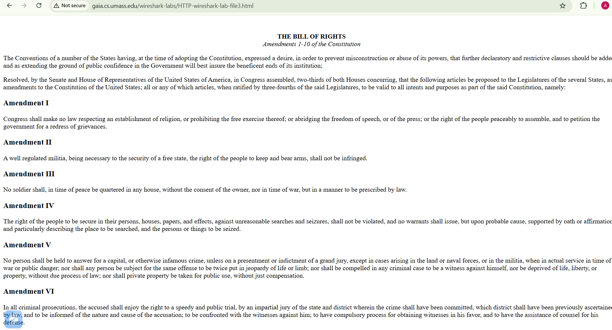
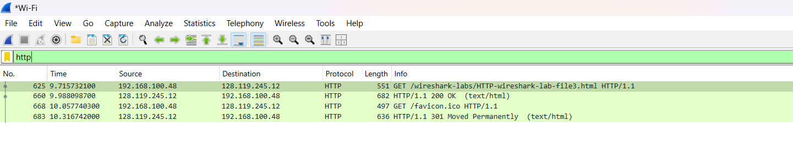
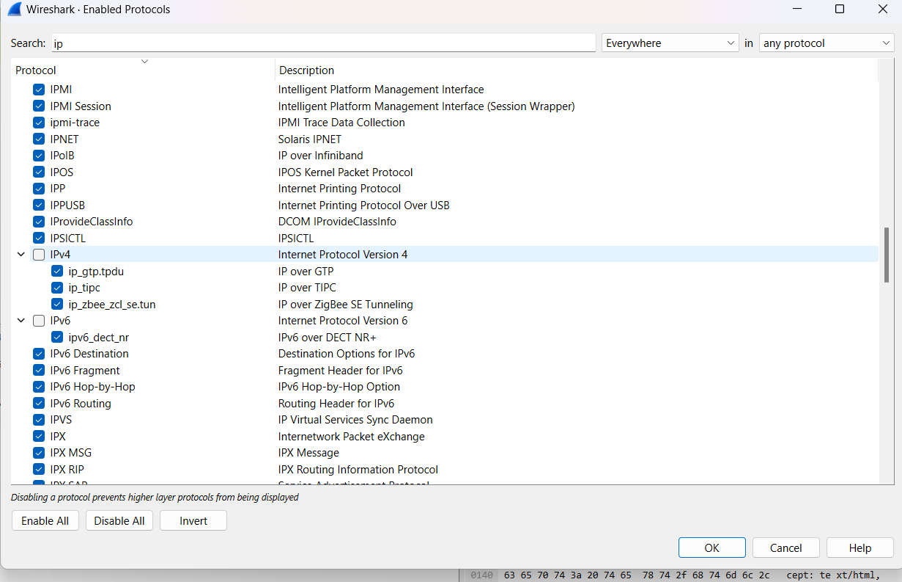
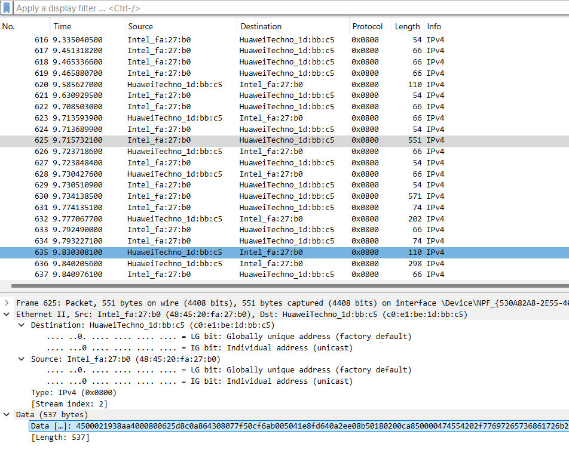
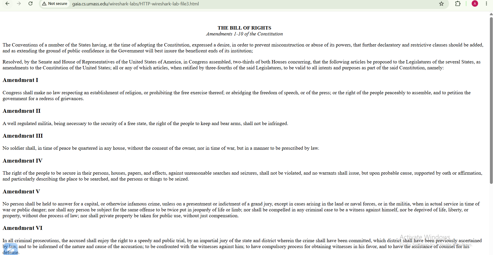
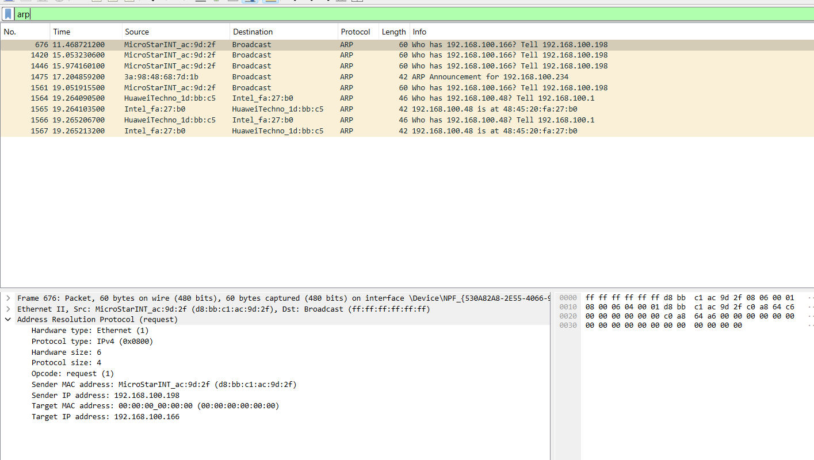

# Laporan Praktikum Jarkom

# Langkah Percobaan
1. 13.2
2. 133

# Lampiran
# 13.2 Menangkap dan menganalisis frame Ethernet
1. ketik http://gaia.cs.umass.edu/wireshark-labs/HTTP-wireshark-lab-file3.html

2. filter http untuk menemukan HTTP GET untuk http://gaia.cs.umass.edu/wireshark-labs/HTTPwireshark-file3.html

3. pilih Analyze -> Enabled Protocols. Kemudian hapus centang pada kotak IP dan pilih OK.

4. Tampilan Wireshark yang menampilkan detail frame Ethernet yang berisi permintaan HTTP GET

# 13.3 Address Resolution Protocol
1. ketik arp -d * di cmd Run as administrator

2. ketik http://gaia.cs.umass.edu/wireshark-labs/HTTP-wireshark-lab-file3.html

3.  Permintaan ARP yang disiarkan dari salah satu komputer

