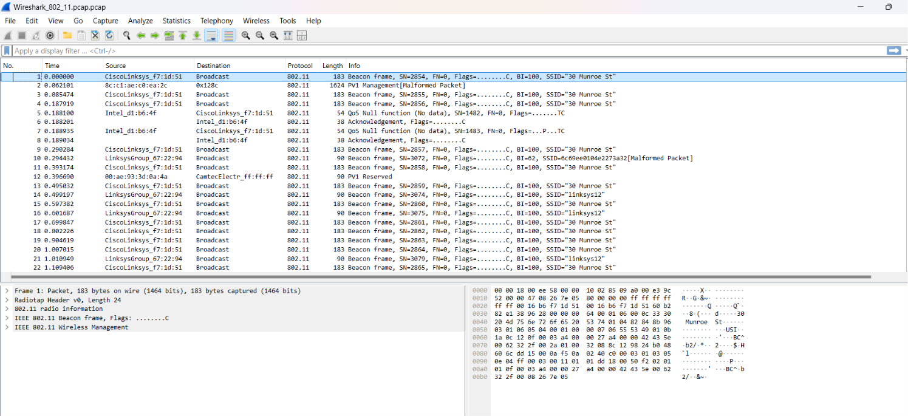
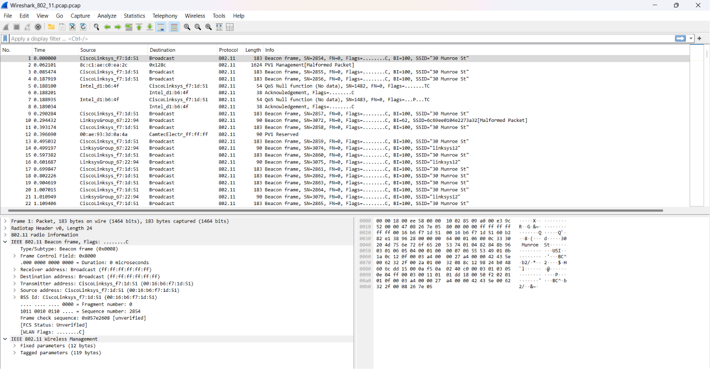
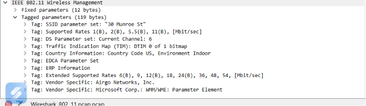
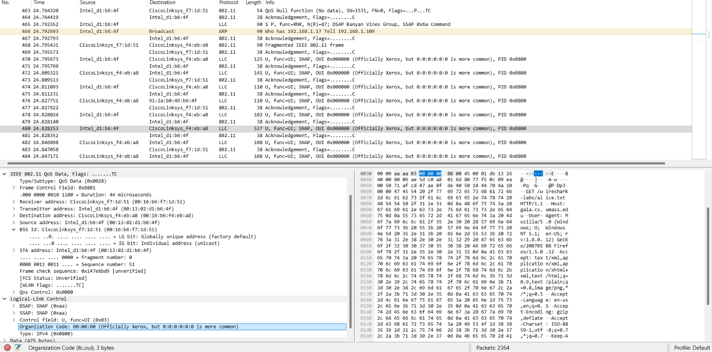
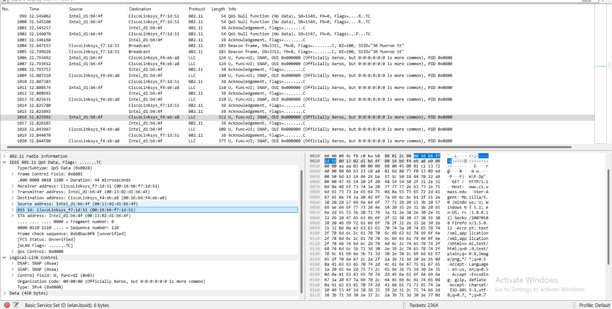
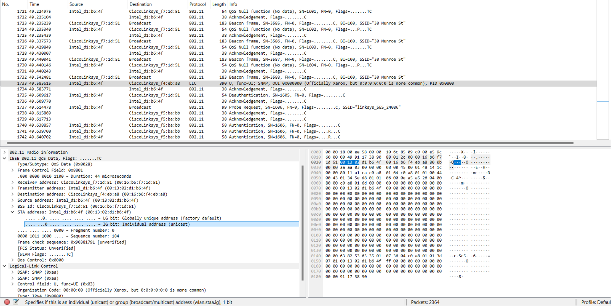
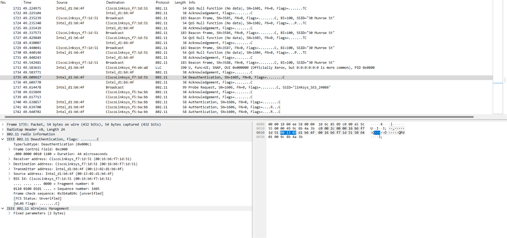
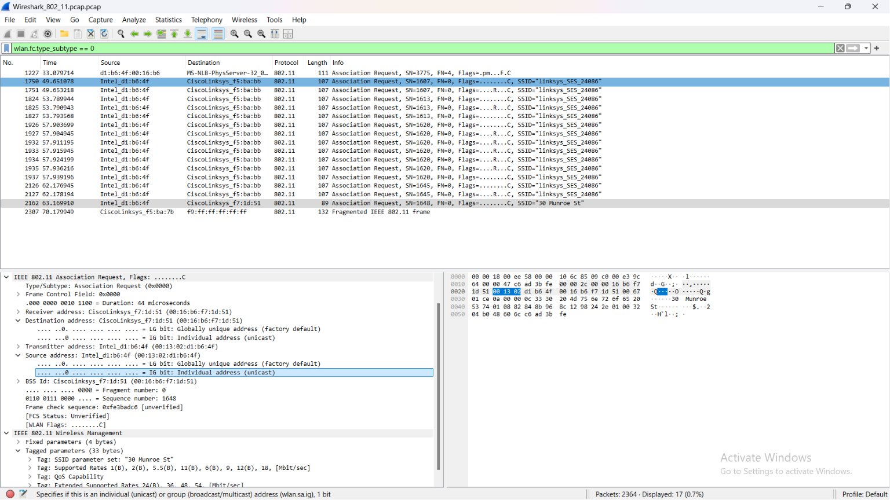
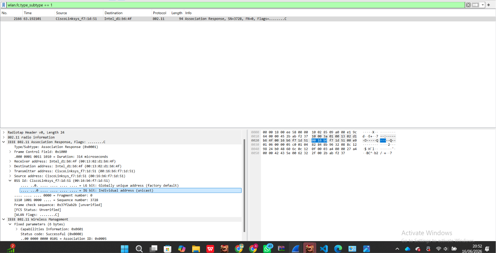

# Laporan Praktikum Jarkom

# Langkah Percobaan
1. 14.2 Frame Beacon
2. 14.4 Transfer Data (Data Transfer)
3. 14.5 Asosiasi dan Disasosiasi

# Lampiran
# 14.2 Frame Beacon
1. Cari paket pertama berjenis Beacon Frame.
2. Periksa detail pada Frame Control Field.
3. Buka bagian Tagged parameters.
4. Amati informasi SSID dan Supported Rates.

# 14.4 Transfer Data (Data Transfer)
# 14.4.1 t = 24.82
1. Cari Paket 480 pada t=24.82.
2. Pastikan kolom Protocol tertulis LLC.
3. Buka Logical-Link Control di panel bawah.
4. Verifikasi jenis protokol adalah IPv4.

# 14.4.2 t = 32.82
1. Cari Paket 1016 pada t=32.82.
2. Periksa protokol IPv4 di Logical-Link Control.
Temukan perintah pengunduhan HTTP.

# 14.5 Asosiasi dan Disasosiasi
# 14.5.1 t = 49.58
1. Ini adalah momen sesaat sebelum koneksi terputus. Paket 1733 merupakan aktivitas transfer data IP terakhir yang dilakukan host di jaringan "30 Munroe St".
2. Cari Paket 1733 pada t=49.58.
3. Identifikasi paket sebagai transmisi LLC.
4. Pastikan ini aktivitas sebelum terputus.

# 14.5.2 t = 49.60
1. Host secara resmi memutuskan sambungan dari Access Point. Paket 1735 mengirimkan frame Deauthentication yang memberi tahu router bahwa komputer telah melepaskan diri dari jaringan.
2. Cari Paket 1735 pada t=49.60.
3.  bertuliskan Deauthentication di info.
4. Buka detail IEEE 802.11.
Verifikasi tipe dan subtipe frame.

# 14.5.3 t = 63.16
1. Setelah gagal di jaringan lain, host akhirnya meminta izin untuk kembali ke jaringan awal. Paket 2162 adalah Association Request menuju target "30 Munroe St".
2. Gunakan filter wlan.fc.type_subtype == 0
3. Cari Paket 2162 pada t=63.16.
4. Buka bagian Tagged parameters.
5. Pastikan target SSID adalah 30 Munroe St.

# 14.5.3 t = 63.19
1. Asosiasi berhasil diselesaikan. Access Point mengirimkan Association Response pada Paket 2166 dengan status Successful, menandakan host telah resmi terhubung kembali ke jaringan.
2. Gunakan filter wlan.fc.type_subtype == 1
3. Cari Paket 2166 pada t=63.19.
4. Buka detail Fixed parameters.
5. Periksa indikator Status code: Successful.

