# Laporan Praktikum Jarkom

# Langkah Percobaan
1. 3.2
2. 3.2.1
3. 3.3
4. 3.4
5. 3.5

# Lampiran

# 3.2 Basic HTTP GET/response interaction
# Membuka aplikasi Wireshark dan memilih interface Wi-Fi yang sedang aktif.
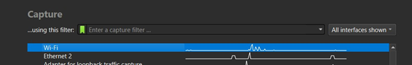
# Menerapkan display filter http untuk membatasi paket yang tertangkap
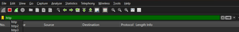
# Mengakses URL http://gaia.cs.umass.edu/wireshark-labs/HTTP-wireshark-file1.html melalui Chrome.
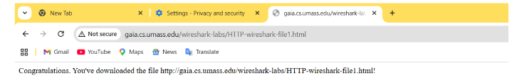
#  Menganalisis GET (No. 3384)
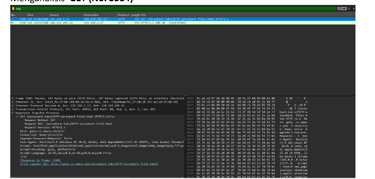

# 3.2.1 HTTP CONDITIONAL GET/response interaction
#  Bersihkan cache browser
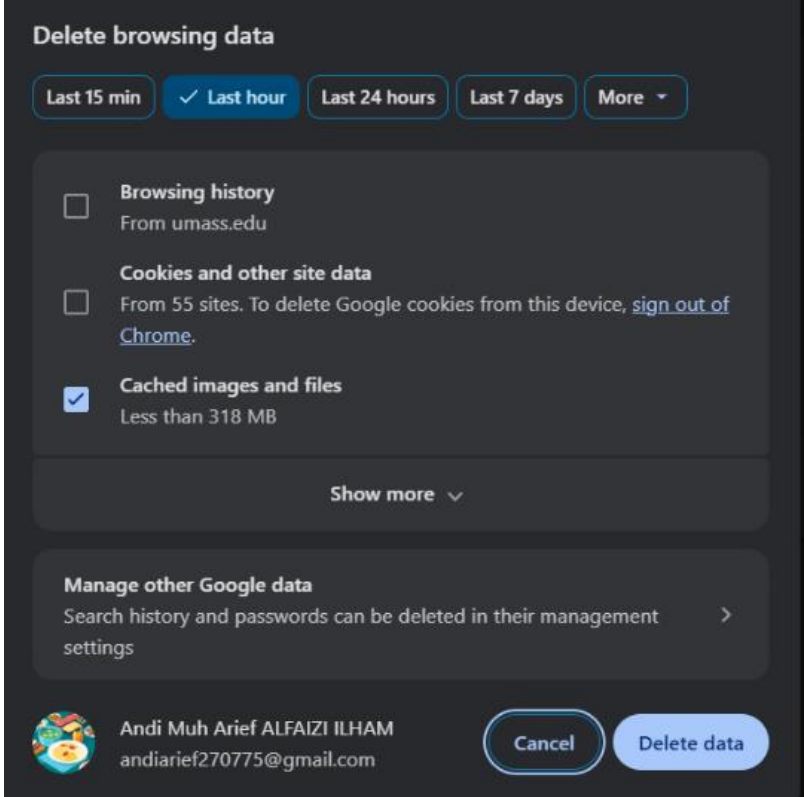
# Jalankan Wireshark dengan filter http
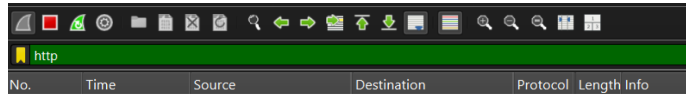
#  Mengakses URL http://gaia.cs.umass.edu/wireshark-labs/HTTP-wireshark-file2.htmlmelalui browser Chrome dan Tekan tombol Refresh pada browser untuk memicupengambilan data bersyarat
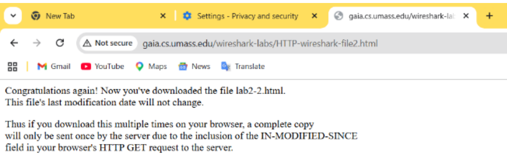
#  Menganalisis 1336 dan 1364 (Akses Pertama) serta 1389 dan 1401. (Akses Kedua).1336
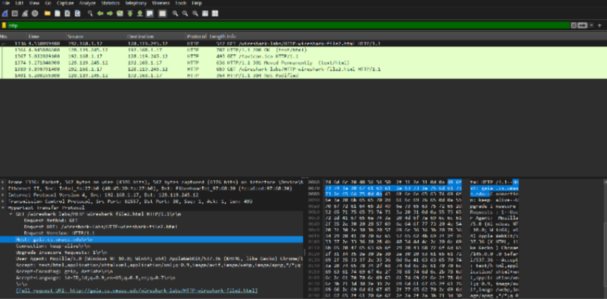
# 1364
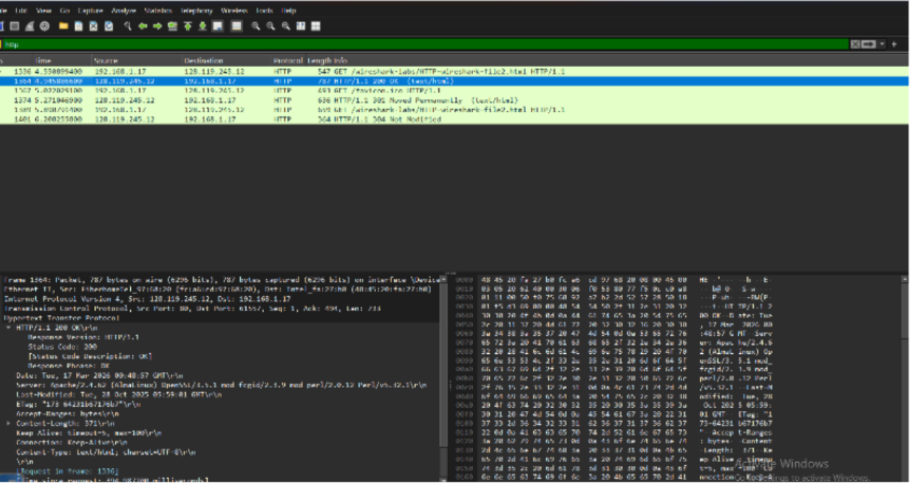
# 1389
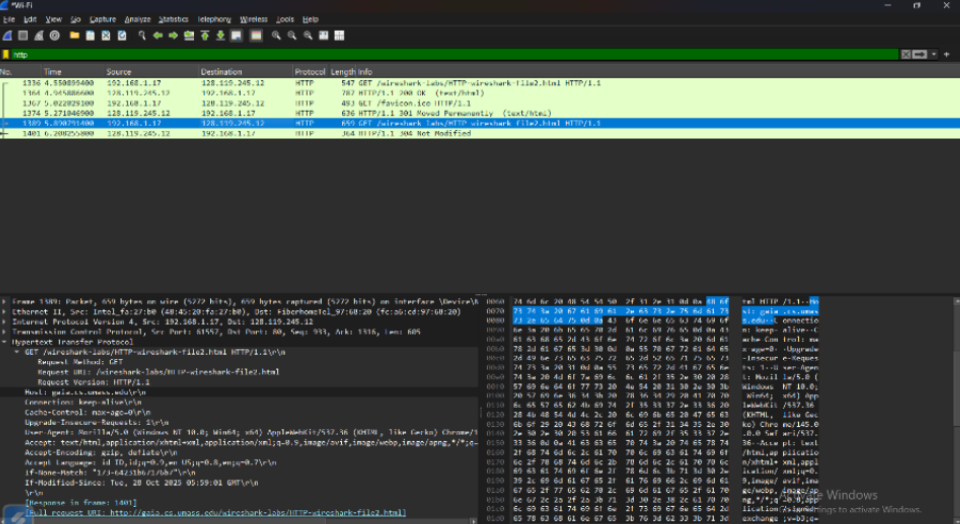
# 1401
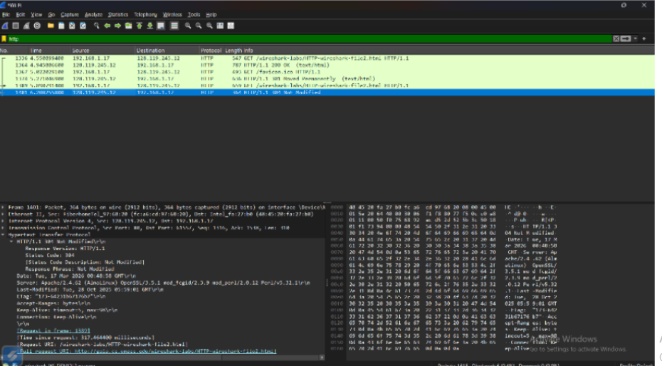

# 3.3 Retrieving Long Documents
# Menghapus cache browser
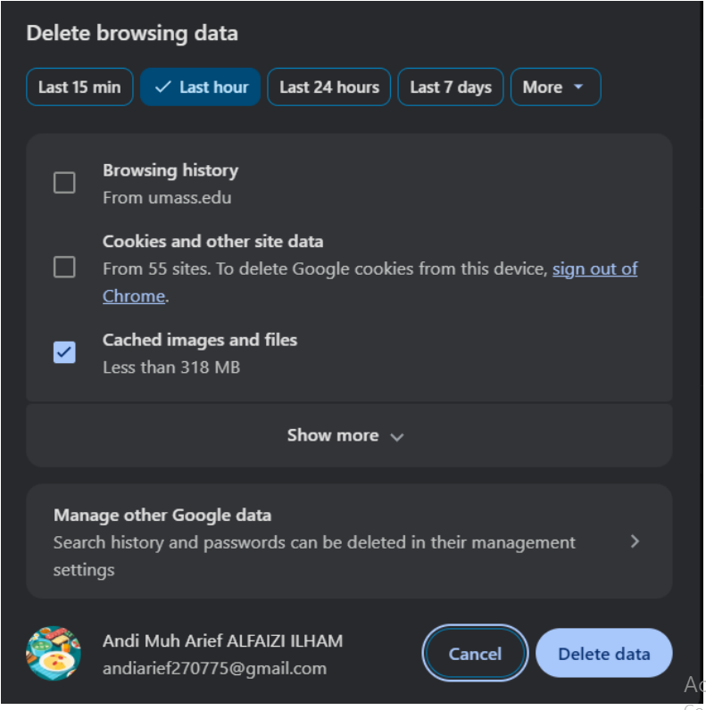
# Jalankan Wireshark dengan filter http
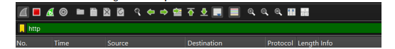
# Mengakses URL http://gaia.cs.umass.edu/wireshark-labs/HTTP-wireshark-file3.html.
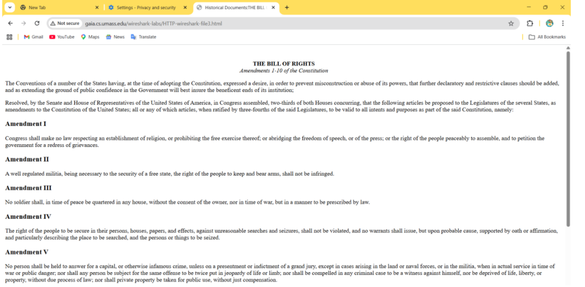
# Menghapus display filter http
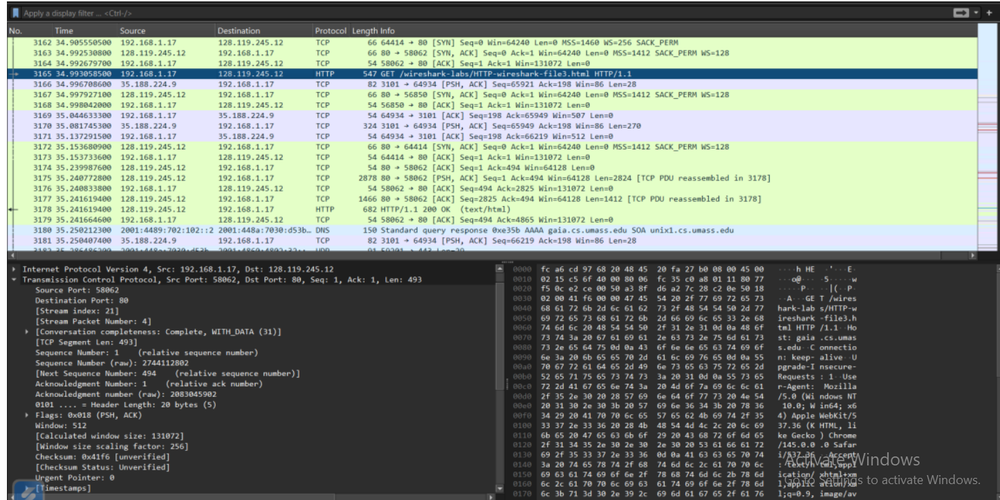
# Mengamati paket TCP (No. 3175) dan TCP (No. 3177)
# TCP (No. 3175)
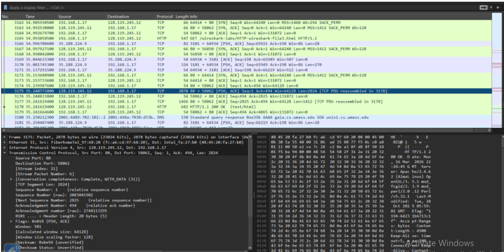
# TCP (No. 3177)
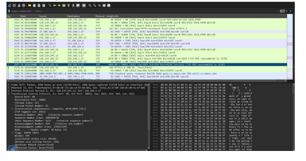
# Menganalisis HTTP 200 OK (No. 3178)
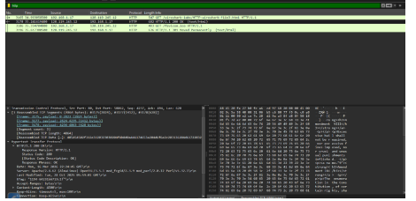

# 3.4 HTML Documents dengan Embedded Objects
# Menghapus cache browser pada menu Settings
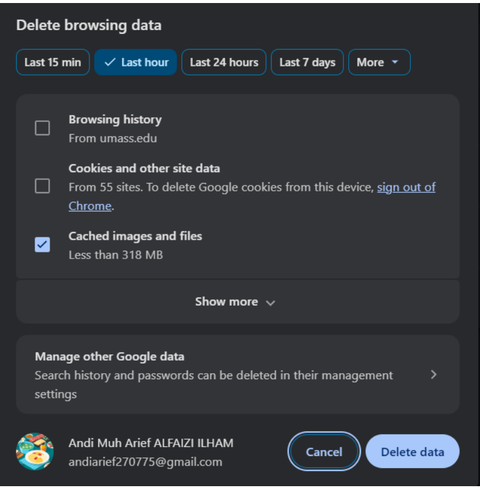
# Menjalankan Wireshark dengan display filter http
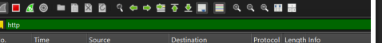
# Mengakses URL http://gaia.cs.umass.edu/wireshark-labs/HTTP-wireshark-file4.html.
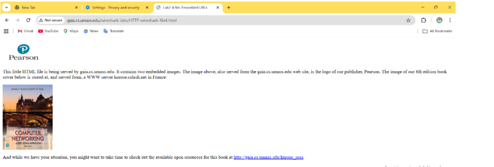
# Mengamati munculnya halaman HTML yang berisi teks serta dua buah gambar (LogoPearson dan Cover Buku).
# 1056 (pearson.png)
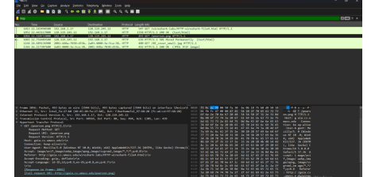
# 1166 (8E_cover_small.jpg)
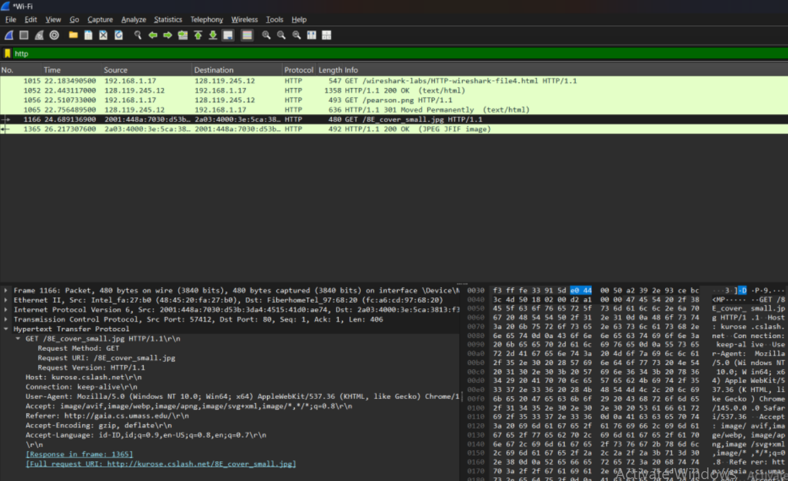
# Menganalisis paket GET (No. 1015)
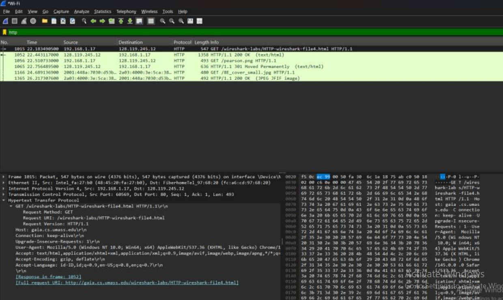

# 3.5  HTTP Authentication
# Menghapus cache browser melalui menu Settings
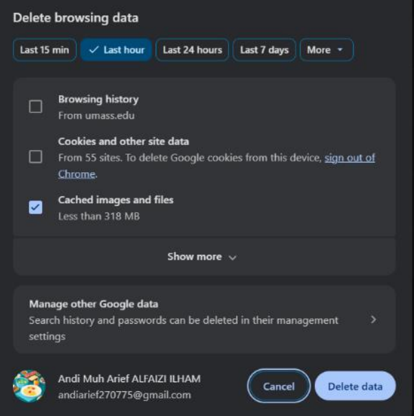
# Menjalankan Wireshark dan menerapkan display filter http

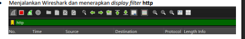
#  Mengakses URL http://gaia.cs.umass.edu/wireshark-labs/protected_pages/HTTPwireshark-file5.html dan memasukkan username wireshark-students serta password network pada kotak dialog yang muncul.
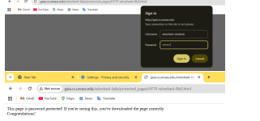
# get (No. 301)
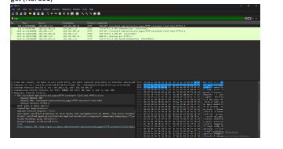
# 401 Unauthorized (No. 311)
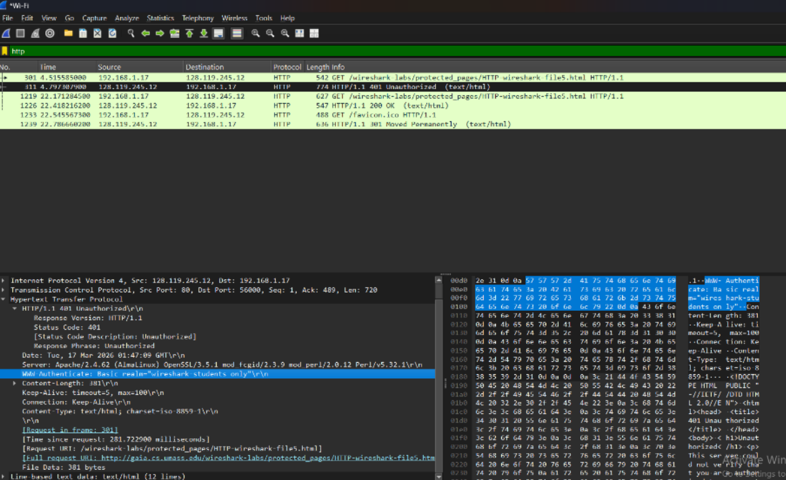
# ET dengan Authorization (No. 1219)
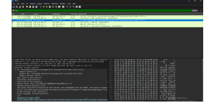