# Laporan Praktikum Jarkom
# Langkah Percobaan
1. 4.2
2. 4.3
3. 4.4
# Lampiran Modul 4 DNS
# Soal 4.2 Nslookup
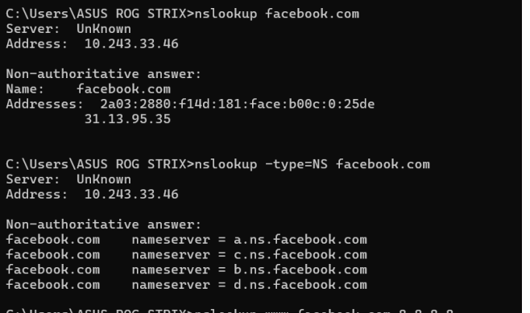
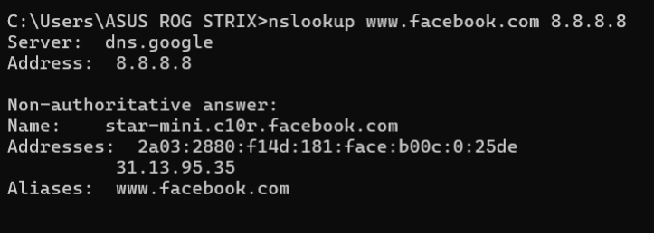
1. Jalankan nslookup untuk mendapatkan alamat IP dari server web di Asia. Berapa alamat IP 
server tersebut? alamat IP dari server web National University of Singapore adalah 45.60.35.225
 !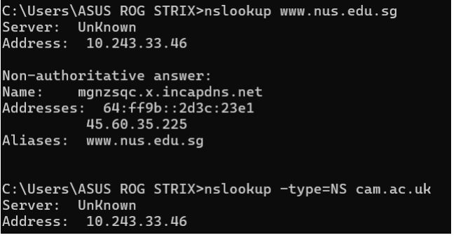
2. Jalankan nslookup agar dapat mengetahui server DNS otoritatif untuk universitas di Eropa
server DNS otoritatif untuk University of Cambridge antara lain adalah dns0.eng.cam.ac.uk,
auth0.dns.cam.ac.uk, dll.
 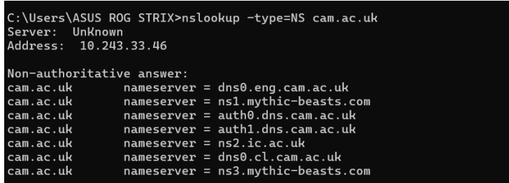

3. Jalankan nslookup untuk mencari tahu informasi mengenai server email dari Yahoo! Mail
melalui salah satu server yang didapatkan di pertanyaan nomor 2. Apa alamat IP-nya? 
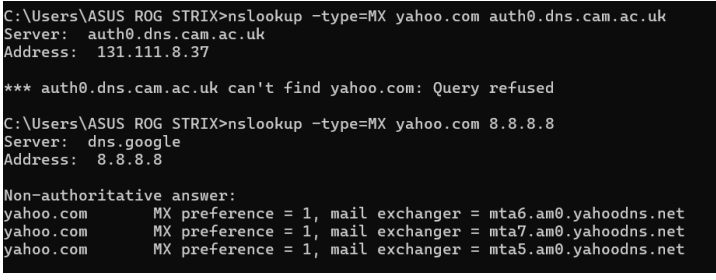

# 4.3.Ipconfig
#ipconfig /all
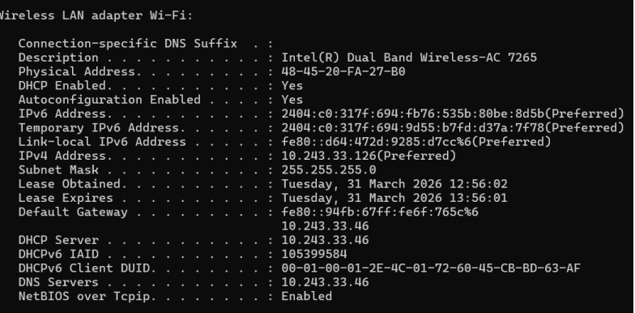
# ipconfig /displaydns
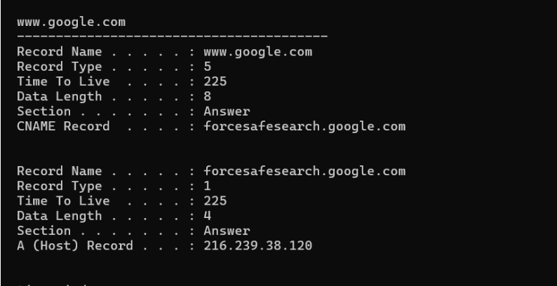
# ipconfig /flushdns
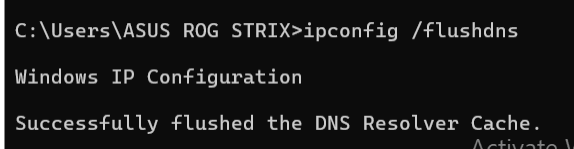

# Soal 4.4 Tracing DNS dengan Wireshark
# Soal Pertama
1.  Cari pesan permintaan DNS dan balasannya. Apakah pesan tersebut dikirimkan melalui UDP
atau TCP?
UDP
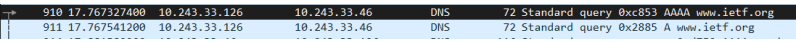
2. Apa port tujuan pada pesan permintaan DNS? Apa port sumber pada pesan balasannya?
(Destination Port / Dst Port) pada pesan permintaan DNS adalah 53.
Sedangkan port sumber (Source Port / Src Port) pada pesan balasan DNS juga adalah 53
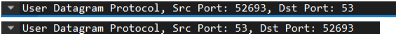
3. Pada pesan permintaan DNS, apa alamat IP tujuannya? Apa alamat IP server DNS lokal anda
(gunakan ipconfig untuk mencari tahu)? Apakah kedua alamat IP tersebut sama?
Internet Protocol Version 4 pada Wireshark ip nya 10.243.33.46.
ipconfig /all ip nya 10.243.33.46.
jadi kedua alamat IP tersebut SAMA
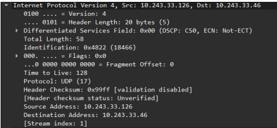
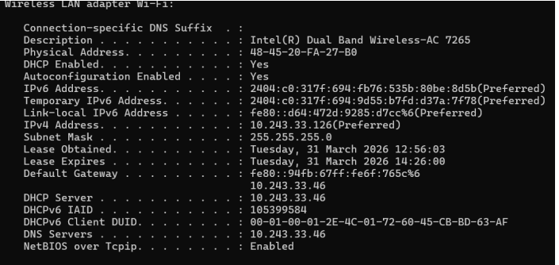
4. Periksa pesan permintaan DNS. Apa “jenis” atau ”type” dari pesan tersebut? Apakah pesan
permintaan tersebut mengandung ”jawaban” atau ”answers”?
type dari pesan permintaan DNS tersebut adalah Type AAAA
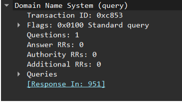
5. Periksa pesan balasan DNS. Berapa banyak ”jawaban” atau ”answers” yang terdapat di dalamnya? Apa
saja isi yang terkandung dalam setiap jawaban tersebut?
Ada 2 yaitu
2606:4700::6810:2c63
2606:4700::6810:2d63
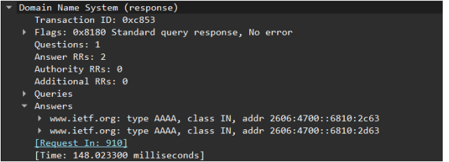
6.  Perhatikan paket TCP SYN yang selanjutnya dikirimkan oleh host Anda. Apakah alamat IP
pada paket tersebut sesuai dengan alamat IP yang tertera pada pesan balasan DNS?
YA, Sesuai. Berdasarkan pengamatan pada paket nomor 985, host mengirimkan paket TCP [SYN] ke
alamat tujuan 2606:4700::6810:2d63.
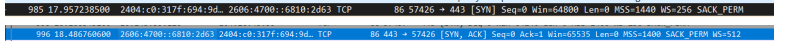
7. . Halaman web yang sebelumnya anda akses (http://www.ietf.org) memuat beberapa
gambar. Apakah host Anda perlu mengirimkan pesan permintaan DNS baru setiap kali ingin
mengakses suatu gambar?
TIDAK. Setelah host melakukan permintaan DNS pertama kali untuk domain www.ietf.org, host akan
mendapatkan alamat IP server tersebut dan menyimpannya di dalam DNS Cache seperti yang dibuktikan
pada percobaan ipconfig /displaydns sebelumnya

# Soal Kedua nslookup www.mit.edu
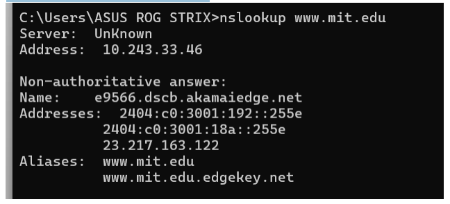
1. Apa port tujuan pada pesan permintaan DNS? Apa port sumber pada pesan balasan DNS? port tujuan
(Destination Port) pada pesan permintaan DNS adalah 53.
Sedangkan port sumber (Source Port) pada pesan balasan DNS juga adalah 53.

2. Ke alamat IP manakah pesan permintaan DNS dikirimkan? Apakah alamat IP tersebut
merupakan default alamat IP server DNS lokal Anda?
YA, alamat IP tersebut sama dengan default alamat IP server DNS lokal yang tercatat pada konfigurasi
jaringan komputer saat pengujian menggunakan perintah ipconfig.
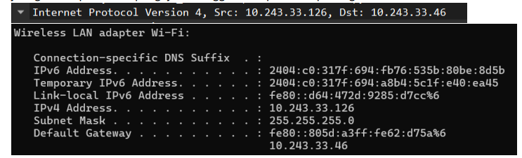
3. Periksa pesan permintaan DNS. Apa ”jenis” atau ”type” dari pesan tersebut? Apakah pesan
tersebut mengandung ”jawaban” atau ”answers”?
Pesan permintaan tersebut tidak mengandung jawaban. Hal ini dibuktikan dengan indikator Answer
RRs: 0 pada detail paket.
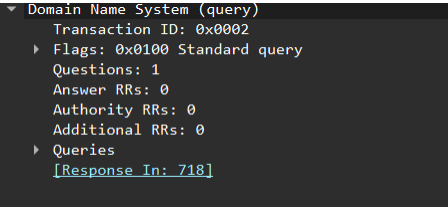
4. Periksa pesan balasan DNS. Berapa banyak ”jawaban” atau “answers” yang terdapat di
dalamnya. Apa saja isi yang terkandung dalam setiap jawaban tersebut?
Ada 3 Yaitu:
www.mit.edu: type CNAME, class IN, cname www.mit.edu.edgekey.net
www.mit.edu.edgekey.net: type CNAME, class IN, cname e9566.dscb.akamaiedge.net
e9566.dscb.akamaiedge.net: type A, class IN, addr 23.217.163.122
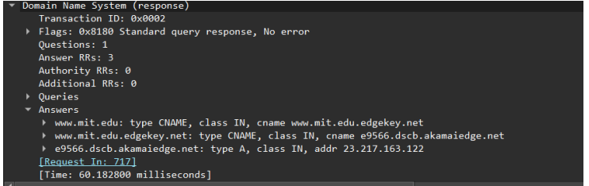
5. Sertakan hasil tangkapan layar.
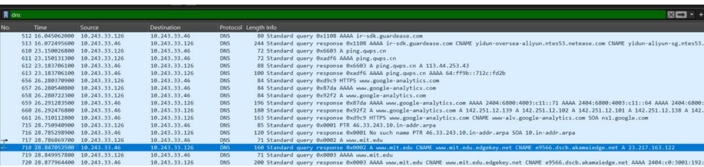

# Soal Ketiga nslookup –type=NS mit.edu
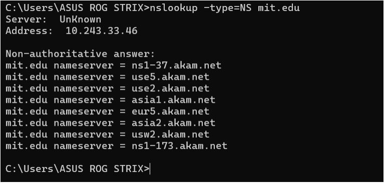
1. Ke alamat IP manakah pesan permintaan DNS dikirimkan? Apakah alamat IP tersebut
merupakan default alamat IP server DNS lokal Anda?
YA, alamat IP tersebut sama dengan default alamat IP server DNS lokal yang tercatat pada konfigurasi
jaringan komputer saat pengujian menggunakan perintah ipconfig.
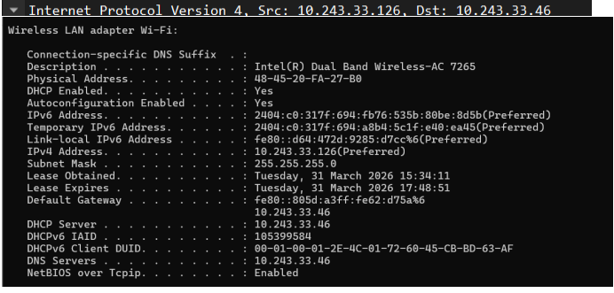
2. Periksa pesan permintaan DNS. Apa ”jenis” atau ”type” dari pesan tersebut? Apakah pesan
tersebut mengandung ”jawaban” atau ”answers”?
Berdasarkan rincian pada Domain Name System (query), jenis atau type dari pesan permintaan DNS
tersebut adalah Type NS (Name Server). Hal ini menunjukkan bahwa sistem sedang mencari tahu server
nama yang otoritatif untuk domain mit.edu
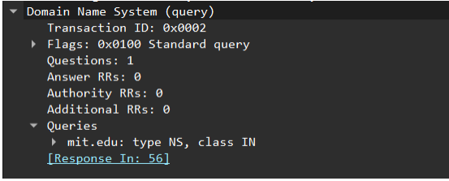
3. Periksa pesan balasan DNS. Apa nama server MIT yang diberikan oleh pesan balasan?
Apakah pesan balasan ini juga memberikan alamat IP untuk server MIT tersebut
Terdapat 8 (delapan) name server yang diberikan sebagai jawaban (Answer RRs: 8) Yaitu:
ns1-37.akam.net
use5.akam.net
use2.akam.net
asia1.akam.net
eur5.akam.net
asia2.akam.net
usw2.akam.net
ns1-173.akam.net
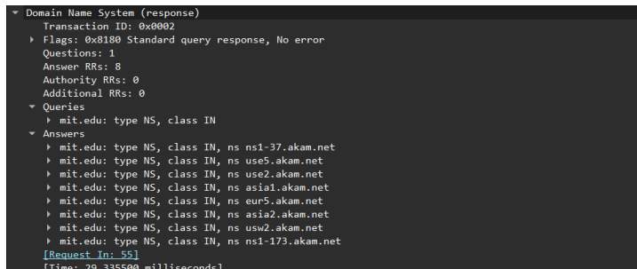
4. Sertakan hasil tangkapan layer
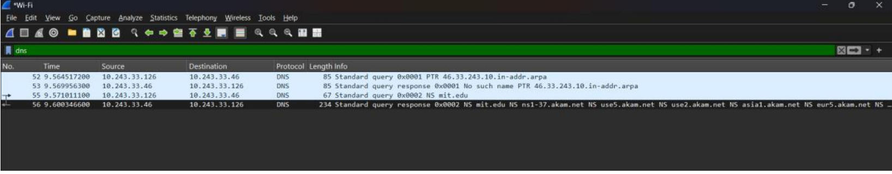

# Soal Keempat nslookup www.aiit.or.kr bitsy.mit.edu
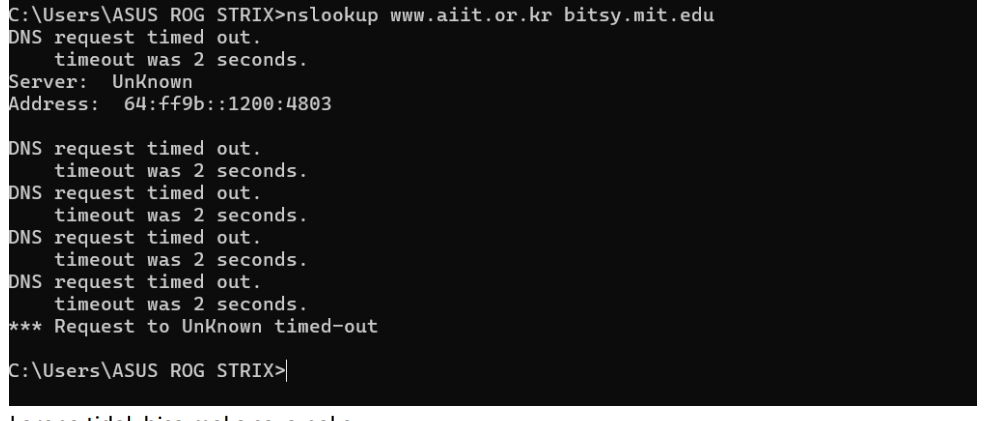
# karena tidak bisa maka saya pake

1. Ke alamat IP manakah pesan permintaan DNS dikirimkan? Apakah alamat IP tersebut
merupakan default alamat IP server DNS lokal Anda?
Pesan permintaan DNS dikirimkan ke alamat IP 18.72.0.3
Bukan. Alamat IP tersebut bukan merupakan DNS lokal default saya. Alamat 18.72.0.3 adalah
alamat IP milik server bitsy.mit.edu
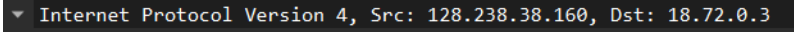
2. Periksa pesan permintaan DNS. Apa ”jenis” atau ”type” dari pesan tersebut? Apakah pesan
tersebut mengandung ”jawaban” atau ”answers”?
Jenis pesan tersebut adalah Type A
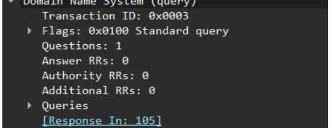
3. Periksa pesan balasan DNS. Berapa banyak ”jawaban” atau “answers” yang terdapat di
dalamnya. Apa saja isi yang terkandung dalam setiap jawaban tersebut?
Answer RRs: 1
Isinya adalah alamat IPv4 untuk host www.aiit.or.kr, yaitu 218.36.94.2
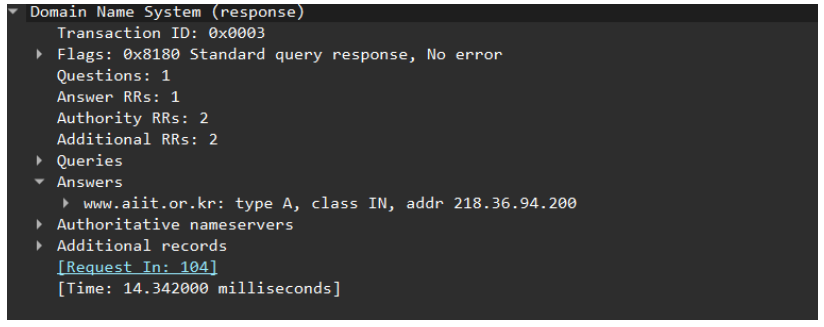
4. Sertakan hasil tangkapan layer
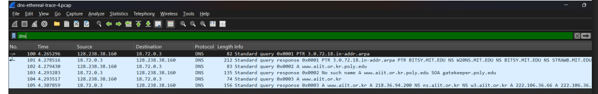
