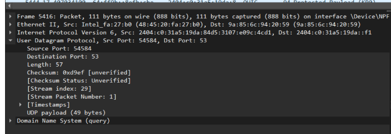
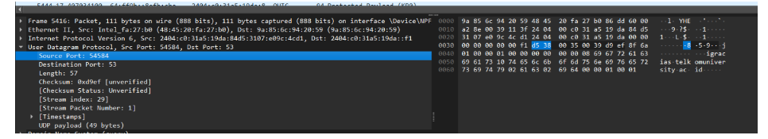
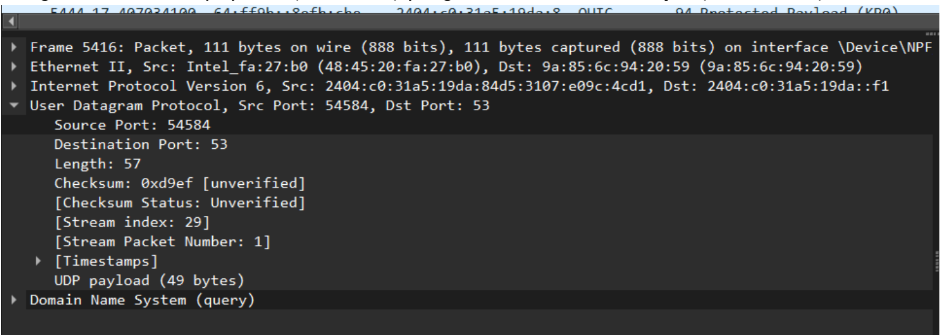
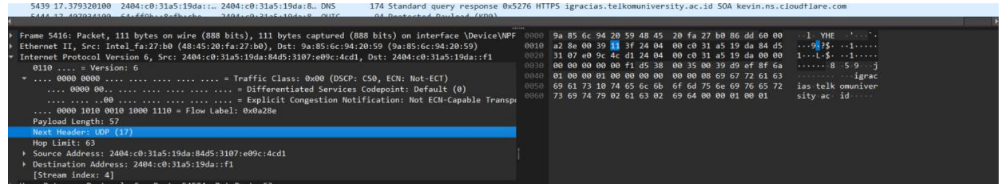
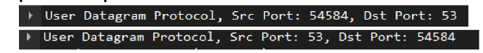

# Laporan Praktikum Jarkom

# Langkah Percobaan
1. 3.2
2. 3.2.1
3. 3.3
4. 3.4
5. 3.5

# Lampiran

# 5.2 Tugas
1. Pilih satu paket UDP yang terdapat pada trace Anda. Dari paket tersebut, berapa banyak
“field” yang terdapat pada header UDP? Sebutkan nama-nama field yang Anda temukan!
Terdapat 4 buah field pada header UDP, yaitu:
Source Port
Destination Port
Length
Checksum
 
2. Perhatikan informasi “content field” pada paket yang Anda pilih di pertanyaan 1. Berapa
panjang (dalam satuan byte) masing-masing “field” yang terdapat pada header UDP?
Panjang masing-masing field yang terdapat pada header UDP adalah 2 byte (16 bit).
 
3. Nilai yang tertera pada ”Length” menyatakan nilai apa? Verfikasi jawaban Anda melalui
paket UDP pada trace.
Nilai yang tertera pada field "Length" menyatakan total panjang dari keseluruhan segmen
UDP (dalam satuan byte), yang merupakan gabungan dari ukuran Header UDP dan ukuran
Data/Payload yang dibawanya.
nilai Length pada header UDP tertera sebesar 57. Nilai ini terverifikasi benar karena
merupakan hasil penjumlahan dari ukuran standar Header UDP yaitu 8 byte, ditambah
dengan ukuran UDP payload (data DNS) yang tertera sebesar 49 byte (8 + 49 = 57).

4. Berapa jumlah maksimum byte yang dapat disertakan dalam payload UDP? (Petunjuk:
jawaban untuk pertanyaan ini dapat ditentukan dari jawaban Anda untuk pertanyaan 2)
2 pangkat 16 =65.536 - 1 = 65.535
65.535 byte (Total) - 8 byte (Header) = 65.527 byte 
5. Berapa nomor port terbesar yang dapat menjadi port sumber? (Petunjuk: lihat petunjuk
pada pertanyaan 4)
65.535
6.  Berapa nomor protokol untuk UDP? Berikan jawaban Anda dalam notasi heksadesimal dan
desimal. Untuk menjawab pertanyaan ini, Anda harus melihat ke bagian ”Protocol” pada
datagram IP yang mengandung segmen UDP.
Nomor protokol untuk UDP yang terdapat pada datagram IP adalah 17 dalam notasi desimal
dan 0x11 dalam notasi heksadesimal.

7. Periksa pasangan paket UDP di mana host Anda mengirimkan paket UDP pertama dan paket
UDP kedua merupakan balasan dari paket UDP yang pertama. (Petunjuk: agar paket kedua
JARINGAN KOMPUTER
merupakan balasan dari paket pertama, pengirim paket pertama harus menjadi tujuan dari
paket kedua). Jelaskan hubungan antara nomor port pada kedua paket tersebut!
Hubungan antara nomor port pada paket pertama dan paket kedua adalah terjadi
pertukaran posisi antara Source Port dan Destination Port.
