# Laporan Praktikum Jarkom

# Langkah Percobaan
1. 5.2

# Lampiran
# 6.2 Menangkap Tansfer TCP dalam Jumlah Besar dari Komputer Pribadi ke Remote Server
1. Klik http://gaia.cs.umass.edu/wireshark-labs/alice.txt
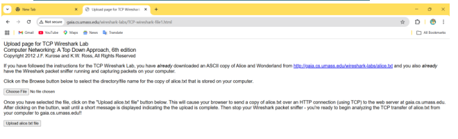
2. Save as file nya
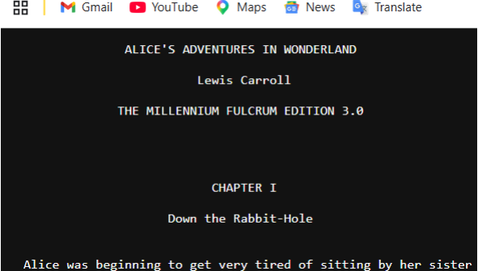
3.  Klik upload dan Choose file
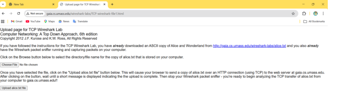
4. http
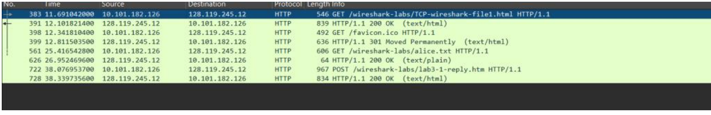

# 6.3 Tampilan Awal pada Captured Trace
1. Berapa alamat IP dan nomor port TCP yang digunakan oleh komputer
klien (sumber) untuk mentransfer file ke gaia.cs.umass.edu? Cara
paling mudah menjawab pertanyaan ini adalah dengan memilih
sebuah pesan HTTP dan meneliti detail paket TCP yang digunakan
untuk membawa pesan HTTP tersebut.
Alamat IP Klien: 10.101.182.126
Nomor Port TCP Klien: 55723
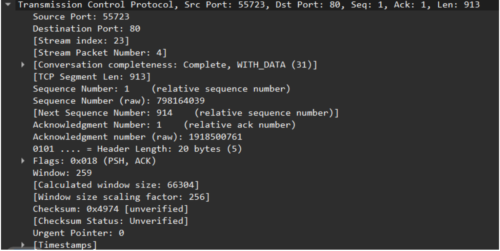
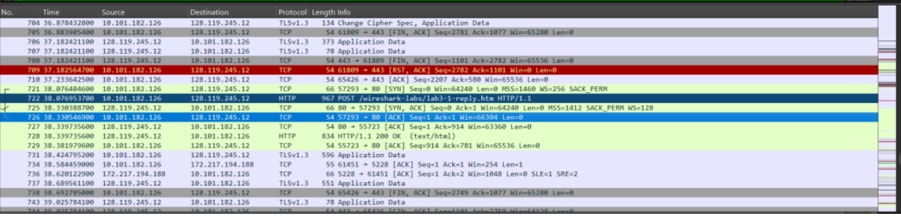
2. Apa alamat IP dari gaia.cs.umass.edu? Pada nomor port berapa ia
mengirim dan menerima segmen TCP untuk koneksi ini?
Alamat IP Server: 128.119.245.12
Nomor Port TCP Server: 80
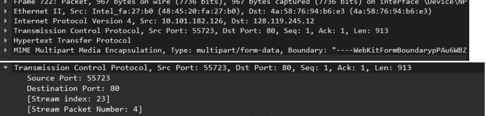
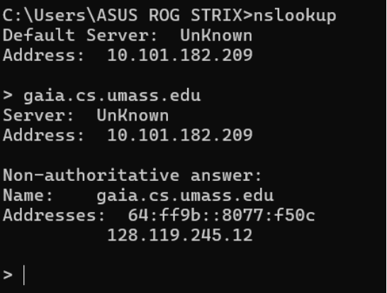
3. Berapa alamat IP dan nomor port TCP yang digunakan oleh komputer klien Anda (sumber) untuk
mentransfer ke gaia.cs.umass.edu?
Alamat IP Klien (Saya): 10.101.182.126
Nomor Port TCP Klien (Saya): 55723

# 6.4 Dasar TCP
1. Berapa nomor urut segmen TCP SYN yang digunakan untuk memulai sambungan TCP
antara komputer klien dan gaia.cs.umass.edu? Apa yang dimiliki segmen tersebut
sehingga teridentifikasi sebagai segmen SYN?
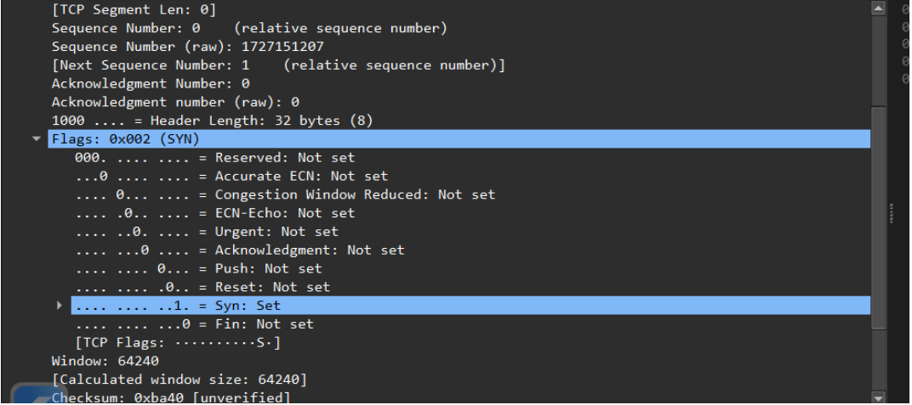
2. Berapa nomor urut segmen SYNACK yang dikirim oleh gaia.cs.umass.edu ke komputer
klien sebagai balasan dari SYN? Berapa nilai dari field Acknowledgement pada segmen
SYNACK? Bagaimana gaia.cs.umass.edu menentukan nilai tersebut? Apa yang dimiliki
oleh segmen sehingga teridentifikasi sebagai segmen SYNACK?
Sequence Number: 0
Acknowledgment Number: 1
Flags: 0x012 (SYN, ACK) dengan rincian Acknowledgment: Set dan Syn: Set
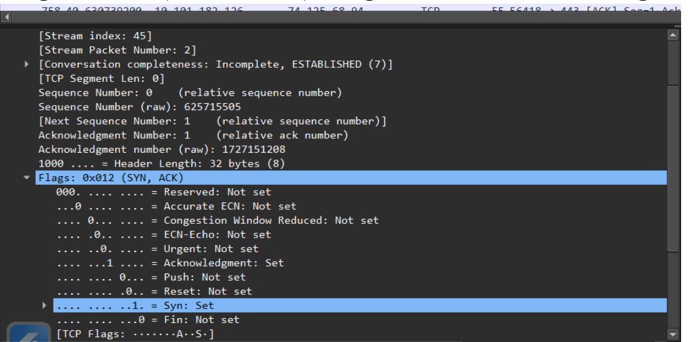
3. Berapa nomor urut segmen TCP yang berisi perintah HTTP POST? Perhatikan bahwa
untuk menemukan perintah POST, Anda harus menelusuri content field milik paket di
bagian bawah jendela Wireshark, kemudian cari segmen yang berisi "POST" di bagian
field DATAnya.
Nomor Urut Segmen (Sequence Number): Nomor urut segmen TCP yang berisi perintah HTTP
POST adalah 1.
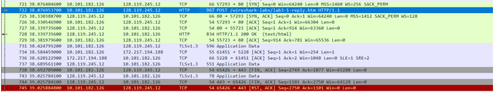
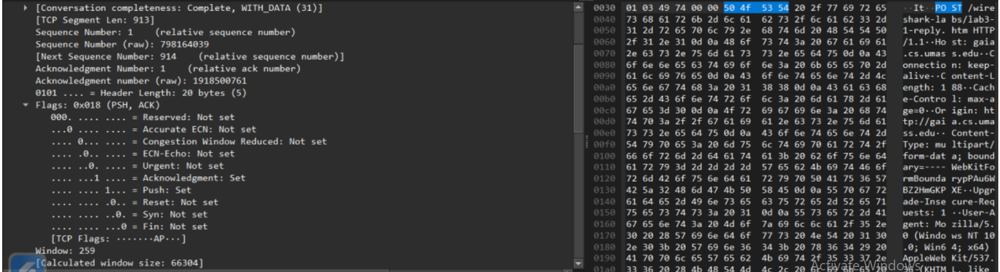
4. Anggap segmen TCP yang berisi HTTP POST sebagai segmen pertama dalam koneksi TCP.
Berapa nomor urut dari enam segmen pertama dalam TCP (termasuk segmen yang berisi
HTTP POST)? Pada jam berapa setiap segmen dikirim? Kapan ACK untuk setiap segmen
diterima? Dengan adanya perbedaan antara kapan setiap segmen TCP dikirim dan kapan
acknowledgement-nya diterima, berapakah nilai RTT untuk keenam segmen tersebut?
Berapa nilai EstimatedRTT setelah penerimaan setiap ACK? (Catatan: Wireshark memiliki
fitur yang memungkinkan Anda untuk memplot RTT untuk setiap segmen TCP yang dikirim.
Pilih segmen TCP yang dikirim dari klien ke server gaia.cs.umass.edu pada jendela "daftar
paket yang ditangkap". Kemudian pilih: Statistics->TCP Stream Graph- >Round Trip Time
Graph).
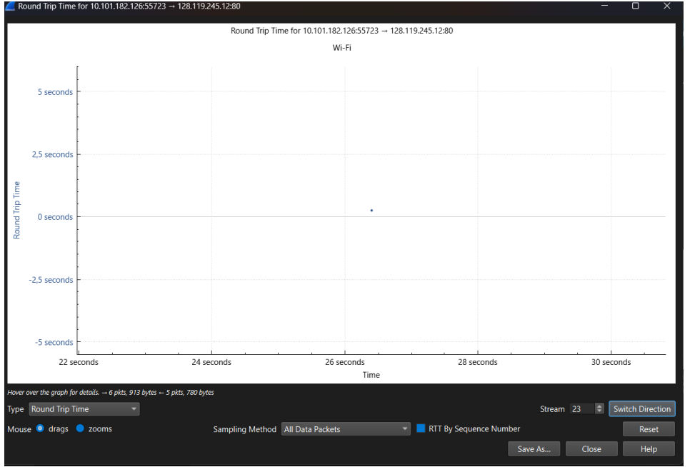
5. Berapa panjang setiap enam segmen TCP pertama?
segmen TCP pertama: 913 byte.
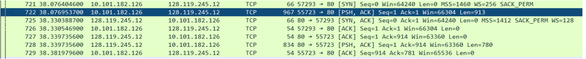
6. Berapa jumlah minimum ruang buffer tersedia yang disarankan kepada penerima dan
diterima untuk seluruh trace? Apakah kurangnya ruang buffer penerima pernah menghambat
pengiriman?
Paket 725: Win=64240
Paket 727: Win=63360
Paket 729: Win=65536
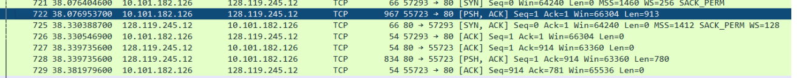
7. Apakah ada segmen yang ditransmisikan ulang dalam file trace? Apa yang anda periksa
(di dalam file trace) untuk menjawab pertanyaan ini?
Tidak, tidak ada segmen TCP yang ditransmisikan ulang dalam proses transfer data ini. cuma 1
segmen

# 6.5 Congestion Control pada TCP
1. Gunakan alat plotting Time-Sequence-Graph (Stevens) untuk melihat grafik nomor urut
berbanding waktu dari segmen yang dikirim oleh klien ke server gaia.cs.umass.edu.
Dapatkah Anda mengidentifikasi di mana fase “slow start” TCP dimulai dan berakhir,
dan pada bagian mana algoritma ”congestion avoidance” mengambil alih? Berikan
komentar tentang bagaimana data yang diukur berbeda dari perilaku ideal TCP yang
telah kita pelajari.
fase Slow Start teridentifikasi di awal transmisi dari detik 0,0 hingga sekitar 0,3 yang ditandai
dengan kenaikan nomor urut secara eksponensial (melengkung), sebelum akhirnya beralih ke
fase Congestion Avoidance hingga detik 5,5 yang polanya berubah menjadi linier (garis lurus
miring). Berbeda dengan perilaku ideal TCP yang biasanya digambarkan sebagai kurva mulus,
grafik realita ini membentuk pola anak tangga (staircase) di mana setiap garis vertikal
menunjukkan pengiriman sekelompok paket secara sekaligus (burst) dan garis horizontal
menunjukkan waktu tunggu Round Trip Time (RTT) untuk menerima konfirmasi (ACK) dari
server sebelum mengirimkan data berikutnya
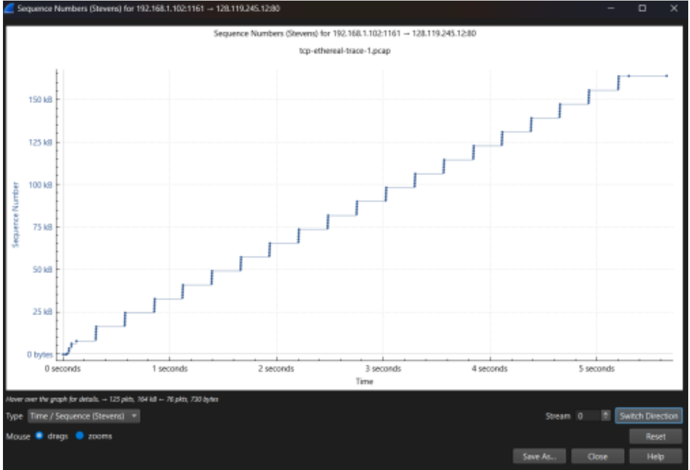
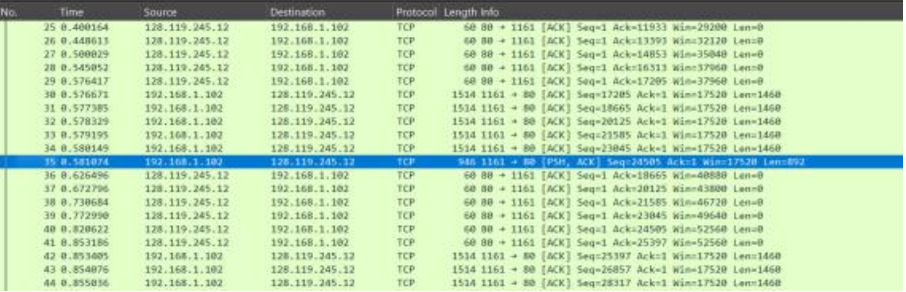