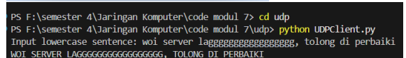
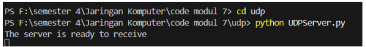
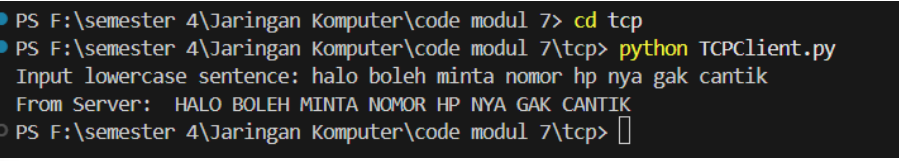
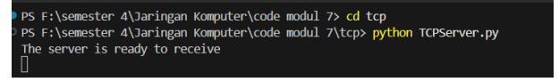

# Laporan Praktikum Jarkom

# Langkah Percobaan
1. 7.2
2. 7.3

# Lampiran
# 7.2 Program Socket dengan UDP
1. UDPClient.py

2. UDPServer.py

# 7.3 Program Socket dengan TCP
1. TCPClient.py

2.  TCPServer.py

