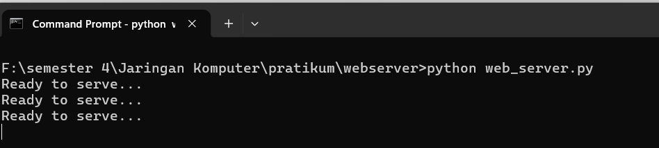
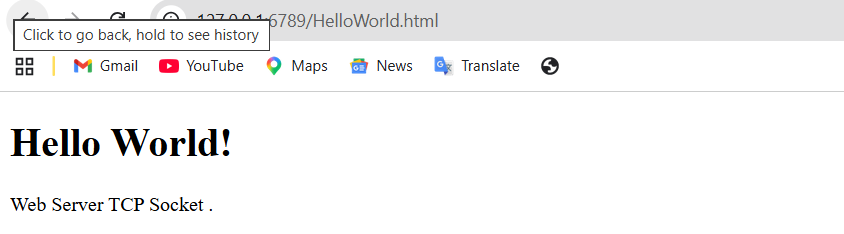
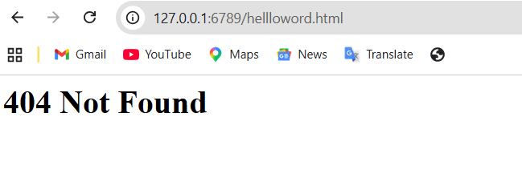
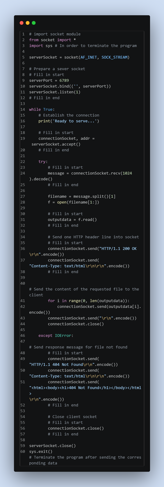
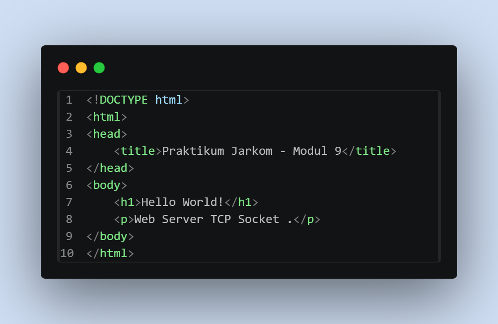

# Laporan Praktikum Jarkom

# Langkah Percobaan
1. 9.3
2. 9.4
3. 9.5
4. 9.6

# Lampiran
# 9.3 Menjalankan Server
1. 

# 9.3 Yang harus dikerjakan
1. 

2. 

# 9.3 Skeleton Kode Python untuk Web Server
1.
 
2. 
